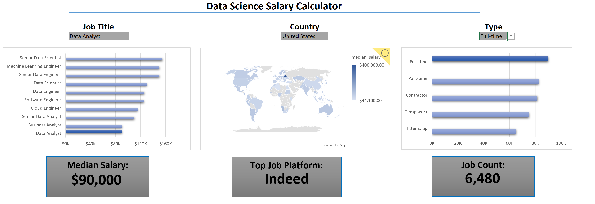
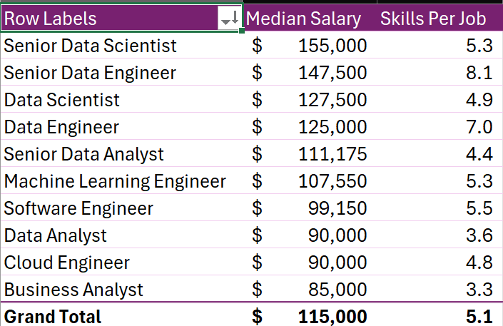
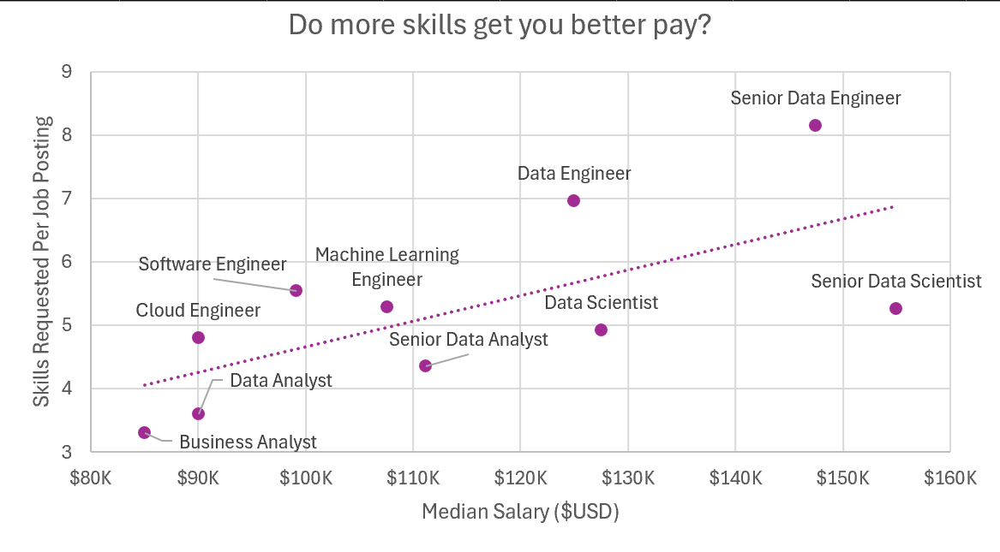

# My Excel Data Analytics Projects
## Salary Dashboard
This project was intended for those searching for work in data. It allows the inquierer to gauge the average salary of different data positions based on their desired country location and their desired position type.   
  
  
To check it out for yourself [click here](Project_1-Dashboard)!

## Salary Analysis
This project was meant to give insight to those trying to break into a data related position and give them insight on what skills employeers request most, and which skill(s) provides the most compensation.  

  
  
To check it out for yourself [click here](Project_2-Analysis)! 
